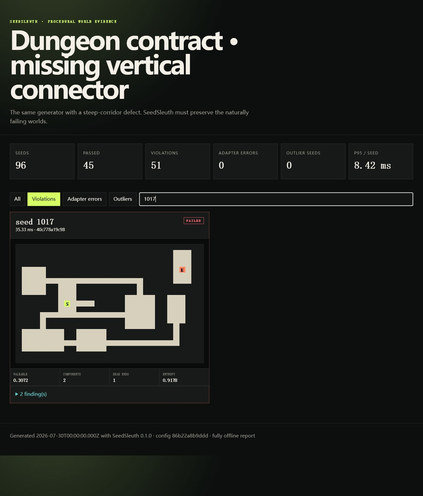

<p align="center">
  
</p>

<p align="center">
  <a href="https://github.com/KanadeK/seed-sleuth/actions/workflows/ci.yml"></a>
  <a href="https://github.com/KanadeK/seed-sleuth/actions/workflows/codeql.yml"></a>
  <a href="https://github.com/KanadeK/seed-sleuth/releases"></a>
  <a href="LICENSE"></a>
  
  <a href="README.zh-CN.md"></a>
</p>

# SeedSleuth

**Run thousands of procedural game seeds, prove the worlds obey your
playability contract, and keep the exact counterexamples.**

[Open the live failure gallery](https://kanadek.github.io/seed-sleuth/) ·
[Adapter guide](docs/ADAPTERS.md) ·
[Contract reference](docs/CONTRACTS.md) ·
[Troubleshooting](docs/TROUBLESHOOTING.md)

Procedural generation bugs hide in seeds that nobody on the team happened to
play. SeedSleuth turns a real generator into a bounded test target. It checks
reachability, connected space, path length, tile counts, density, sealed
borders, and marker separation; repeats seeds to expose nondeterminism; then
writes portable evidence for humans and CI.

```text
PASS healthy connector: 96/96 seeds pass
PASS faulty connector: 51 failing seed(s) preserved
```

That output comes from the bundled rooms-and-corridors generator. Its faulty
mode contains an algorithmic connector defect: steep room pairs receive the
horizontal corridor segment but lose the vertical one. There is no
seed-specific `if` and no fixed result file. SeedSleuth executes both versions,
finds naturally broken worlds, and saves their grids and violations.

<p align="center">
  
</p>

## Five-minute proof

Requirements: Node.js 20 or newer. There are no package dependencies.

```bash
git clone https://github.com/KanadeK/seed-sleuth.git
cd seed-sleuth
npm ci
npm run demo
```

Open `tmp/demo/faulty/report.html`. Filter to violations, search for seed
`1017`, and compare it with `tmp/demo/healthy/report.html`.

Run one contract directly:

```bash
node bin/seed-sleuth.js sweep examples/dungeon/faulty.config.json \
  --out tmp/my-sweep \
  --format all
```

The command intentionally exits `2` because it proved contract failures.
`report.json`, `report.html`, `junit.xml`, and `summary.md` still contain the
successful diagnosis.

Install the GitHub Release package:

```bash
npm install --global \
  https://github.com/KanadeK/seed-sleuth/releases/download/v0.1.0/seed-sleuth-0.1.0.tgz
seed-sleuth demo --out ./seed-sleuth-demo
```

## What is real in v0.1.0

| Capability | Behavior |
| --- | --- |
| Module adapters | Import a trusted ESM generator in a bounded worker pool; each seed receives a cloned options object. |
| Command adapters | Start an explicit executable and argument array with `shell: false`; parse one JSON world from stdout. |
| Failure containment | Apply per-seed timeouts, worker memory limits, maximum cell counts, maximum serialized bytes, and bounded stderr capture. |
| Determinism check | Generate the same seed up to five times and compare canonical SHA-256 world fingerprints. |
| Playability contracts | Evaluate counts, reachability, shortest-path bounds, connected components, numeric metric ranges, borders, and Manhattan separation. |
| Quality telemetry | Measure walkable ratio, component sizes, dead ends, border breaches, tile entropy, and robust median/MAD outliers. |
| Evidence | Emit stable result objects plus offline HTML, JSON, JUnit, and Markdown reports. |
| Automation | Return distinct contract and adapter exit codes and ship a dependency-free GitHub Action. |

SeedSleuth v0.1.0 targets rectangular symbolic grids. A generator can be
written in any engine or language if a command adapter exports that grid
protocol. It does not simulate player skill, judge whether a level is fun, or
make untrusted adapter code safe.

## Add it to a generator

Create a starter adapter and config:

```bash
seed-sleuth init ./world-contract
seed-sleuth sweep ./world-contract/seed-sleuth.config.json
```

A module adapter exports one function:

```js
export function generate(seed, options) {
  return {
    format: "seed-sleuth-world",
    schemaVersion: 1,
    seed,
    width: 5,
    height: 5,
    cells: ["#####", "#S..#", "#.#.#", "#..E#", "#####"],
    metadata: { biome: options.biome }
  };
}
```

The config declares the seed sample and its guarantees:

```json
{
  "format": "seed-sleuth-config",
  "schemaVersion": 1,
  "name": "Release dungeon contract",
  "generator": {
    "kind": "module",
    "path": "./adapter.js",
    "options": { "biome": "crypt" }
  },
  "seeds": { "start": 1, "count": 1000, "step": 1 },
  "limits": {
    "concurrency": 4,
    "timeoutMs": 2000,
    "maxWorldBytes": 1000000,
    "maxCells": 1000000,
    "repeats": 2,
    "maxFailures": 100
  },
  "tiles": { "walkable": [".", "S", "E"], "blocked": ["#"] },
  "assertions": [
    { "id": "one-start", "type": "count", "symbol": "S", "eq": 1 },
    { "id": "one-exit", "type": "count", "symbol": "E", "eq": 1 },
    { "id": "exit-reachable", "type": "reachable", "from": "S", "to": "E" },
    { "id": "connected", "type": "connected", "max": 1 },
    { "id": "sealed", "type": "border", "allowedSymbols": ["#"] }
  ],
  "capture": "failures-and-outliers"
}
```

For Godot, Unity, Unreal, Python, Rust, or a compiled game tool, use a command
adapter. SeedSleuth replaces `{seed}` and `{options}` in individual arguments
without invoking a shell:

```json
{
  "kind": "command",
  "command": "python",
  "args": ["tools/export_world.py", "--seed", "{seed}", "--options", "{options}"],
  "cwd": "."
}
```

Read [the adapter and trust-boundary guide](docs/ADAPTERS.md) before running
third-party generator code.

## Commands and exits

```text
seed-sleuth sweep <config> [--out DIR] [--format all|json,html,junit,markdown]
seed-sleuth replay <config> --seed N
seed-sleuth validate <world.json> <config>
seed-sleuth init [directory]
seed-sleuth demo [--out DIR]
```

| Exit | Meaning | Repair direction |
| ---: | --- | --- |
| `0` | Requested checks passed. | No repair required. |
| `1` | Usage, JSON, config, or filesystem error. | Validate paths and config shape. |
| `2` | A world contract failed. | Replay the seed, inspect evidence, repair the generator or intentionally revise the contract. |
| `3` | Adapter timed out, crashed, or returned an invalid world. | Run the adapter directly and repair its protocol, runtime, or limit. |

`--fail-on warning` promotes warning contracts to exit `2`;
`--fail-on none` always returns `0` after a completed sweep but never hides
adapter errors. The complete symptom-to-command procedure is in
[Troubleshooting and repair](docs/TROUBLESHOOTING.md).

## GitHub Action

```yaml
- uses: KanadeK/seed-sleuth@v0.1.0
  with:
    config: worldgen/seed-sleuth.config.json
    output: artifacts/seed-sleuth
    fail-on: error
- uses: actions/upload-artifact@v4
  if: always()
  with:
    name: seed-sleuth-report
    path: artifacts/seed-sleuth
```

The Action appends a Markdown summary to the job and exposes `report`,
`passed`, `failed`, and `adapter-errors` outputs. It does not upload anything
unless the workflow explicitly adds an artifact step.

## Architecture

```text
config + seed range
        │
        ├─ module adapter → bounded persistent worker pool ─┐
        └─ command adapter → shell-free child process ──────┤
                                                            ▼
                                                  world protocol gate
                                                            │
                       ┌────────────────────────────────────┼─────────────┐
                       ▼                                    ▼             ▼
               graph + tile metrics                  contracts     fingerprints
                       └────────────────────────────────────┬─────────────┘
                                                            ▼
                                                outliers + evidence report
```

The CLI, library, Action, and tests use the same runner and assertions. See
[Architecture](docs/ARCHITECTURE.md) for failure isolation and report capture
decisions.

## Acceptance and release gates

```bash
npm run verify
npm run test:coverage
npm run package
npm run determinism-check
npm run release-check -- --allow-untagged
```

- `verify` runs source/JSON hygiene, 22 real regression tests, the two-sided
  generator demo, and the static report build.
- `package` creates the installable `.tgz`, offline demo assets, SHA-256
  manifest, then installs that exact archive in a clean temporary project and
  runs its demo.
- `determinism-check` creates archives more than two seconds apart and requires
  byte identity.
- `release-check` requires a clean Git tree, consistent versions, verified
  checksums, expected archive contents, secret hygiene, and clean contributor
  trailers.

## Research and scope

The problem selection, GitHub query counts, community pain evidence, academic
context, and comparison with generators, RL benchmarks, and generic
property-testing libraries are recorded in
[Research and positioning](docs/RESEARCH.md). SeedSleuth is deliberately a
quality-contract runner, not another level generator, replay desync analyzer,
map editor, or game-feel tuner.

## Contributing

Read [CONTRIBUTING.md](CONTRIBUTING.md), follow the
[Code of Conduct](CODE_OF_CONDUCT.md), and report vulnerabilities through
[SECURITY.md](SECURITY.md). Licensed under the [MIT License](LICENSE).
