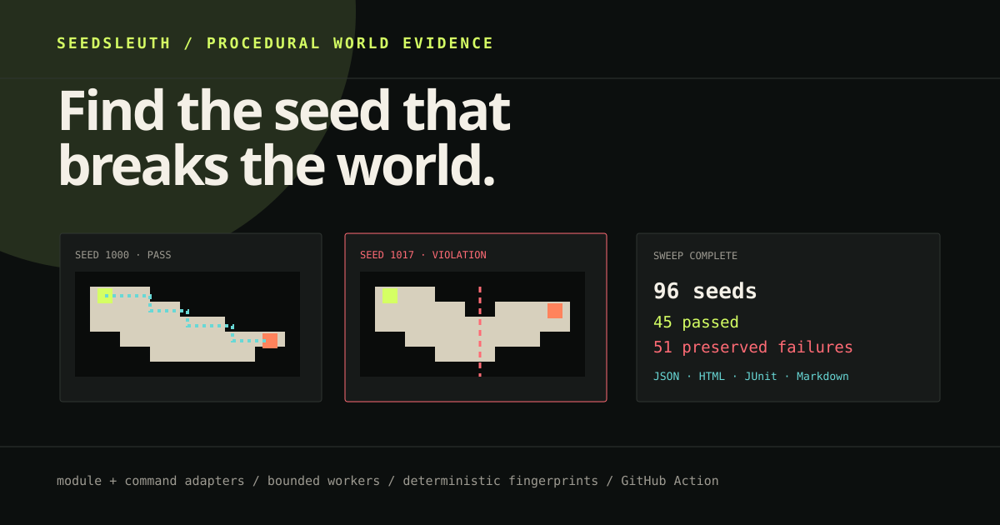

<p align="center">
  
</p>

<p align="center">
  <a href="https://github.com/KanadeK/seed-sleuth/actions/workflows/ci.yml"></a>
  <a href="https://github.com/KanadeK/seed-sleuth/releases"></a>
  <a href="LICENSE"></a>
  <a href="README.md"></a>
</p>

# SeedSleuth

**批量运行成千上万个程序化游戏种子，验证地图是否满足可玩性契约，并保留可复现的失败世界。**

[查看在线失败地图集](https://kanadek.github.io/seed-sleuth/) ·
[适配器指南](docs/ADAPTERS.md) ·
[契约参考](docs/CONTRACTS.md) ·
[故障修复流程](docs/TROUBLESHOOTING.md)

程序化生成错误往往藏在团队从未碰巧玩到的种子里。SeedSleuth 会把真实生成器变成一个有资源边界的测试目标：检查起点/出口数量、可达性、连通区域、最短路、地图密度、封闭边界和标记间距；重复运行同一个种子以发现不确定性；最后为人和 CI 生成可携带的证据。

```text
PASS healthy connector: 96/96 seeds pass
PASS faulty connector: 51 failing seed(s) preserved
```

这不是固定输出。仓库内置的房间—走廊生成器包含两个模式：修复版会绘制连接走廊的两段；缺陷版在陡峭房间对之间漏掉纵向段。SeedSleuth 真实执行 96 个种子，稳定找出自然产生的断图并保存网格与证据。

## 五分钟验收

需要 Node.js 20 或更高版本；没有运行时或开发依赖。

```bash
git clone https://github.com/KanadeK/seed-sleuth.git
cd seed-sleuth
npm ci
npm run demo
```

打开 `tmp/demo/faulty/report.html`，筛选 Violations 并搜索种子 `1017`；再与 `tmp/demo/healthy/report.html` 对照。

直接运行一次完整扫测：

```bash
node bin/seed-sleuth.js sweep examples/dungeon/faulty.config.json \
  --out tmp/my-sweep \
  --format all
```

命令会故意返回退出码 `2`，因为它成功证明了契约失败；诊断结果仍完整保存在 `report.json`、`report.html`、`junit.xml` 和 `summary.md` 中。

从 GitHub Release 安装：

```bash
npm install --global \
  https://github.com/KanadeK/seed-sleuth/releases/download/v0.1.0/seed-sleuth-0.1.0.tgz
seed-sleuth demo --out ./seed-sleuth-demo
```

## v0.1.0 的真实能力

| 能力 | 行为 |
| --- | --- |
| JavaScript 模块适配器 | 在持久、受限的 Worker 池中导入可信 ESM 生成器，每个种子得到独立配置副本。 |
| 外部命令适配器 | 用显式可执行文件与参数数组启动进程，强制 `shell: false`，从 stdout 读取一个 JSON 世界。 |
| 故障边界 | 提供单种子超时、Worker 内存限制、最大格数、最大序列化字节数和 stderr 上限。 |
| 确定性检查 | 同一生成种子最多重复五次，对规范化世界计算 SHA-256 指纹。 |
| 可玩性契约 | 支持数量、可达性、最短路范围、连通分量、数值指标、边界和曼哈顿间距。 |
| 质量遥测 | 计算可走比例、分量大小、死路、边界泄漏、图块熵，并用中位数/MAD 发现异常。 |
| 证据 | 输出稳定 JSON 结构，以及离线 HTML、JUnit 和 Markdown 报告。 |
| 自动化 | 契约失败与适配器失败使用不同退出码，并提供零依赖 GitHub Action。 |

v0.1.0 面向矩形符号网格。Godot、Unity、Unreal、Python、Rust 或自研引擎只要通过命令适配器导出该协议即可接入。它不会模拟玩家技巧、判断关卡是否“有趣”，也不会把不可信代码变成安全代码。

## 接入你的生成器

先生成模板：

```bash
seed-sleuth init ./world-contract
seed-sleuth sweep ./world-contract/seed-sleuth.config.json
```

模块适配器只需导出一个函数：

```js
export function generate(seed, options) {
  return {
    format: "seed-sleuth-world",
    schemaVersion: 1,
    seed,
    width: 5,
    height: 5,
    cells: ["#####", "#S..#", "#.#.#", "#..E#", "#####"],
    metadata: { biome: options.biome }
  };
}
```

配置文件声明种子样本和质量保证：

```json
{
  "format": "seed-sleuth-config",
  "schemaVersion": 1,
  "name": "Release dungeon contract",
  "generator": {
    "kind": "module",
    "path": "./adapter.js",
    "options": { "biome": "crypt" }
  },
  "seeds": { "start": 1, "count": 1000, "step": 1 },
  "tiles": { "walkable": [".", "S", "E"], "blocked": ["#"] },
  "assertions": [
    { "id": "one-start", "type": "count", "symbol": "S", "eq": 1 },
    { "id": "exit-reachable", "type": "reachable", "from": "S", "to": "E" },
    { "id": "connected", "type": "connected", "max": 1 },
    { "id": "sealed", "type": "border", "allowedSymbols": ["#"] }
  ],
  "capture": "failures-and-outliers"
}
```

其他语言或引擎使用外部命令适配器。`{seed}` 和 `{options}` 只会替换单个参数，不会交给 Shell：

```json
{
  "kind": "command",
  "command": "python",
  "args": ["tools/export_world.py", "--seed", "{seed}", "--options", "{options}"],
  "cwd": "."
}
```

运行第三方生成器前请阅读[适配器与信任边界](docs/ADAPTERS.md)。

## 命令与退出码

```text
seed-sleuth sweep <config> [--out DIR] [--format all|json,html,junit,markdown]
seed-sleuth replay <config> --seed N
seed-sleuth validate <world.json> <config>
seed-sleuth init [directory]
seed-sleuth demo [--out DIR]
```

| 退出码 | 含义 | 修复方向 |
| ---: | --- | --- |
| `0` | 请求的检查通过。 | 无需修复。 |
| `1` | 命令、JSON、配置或文件错误。 | 检查路径和配置结构。 |
| `2` | 世界违反契约。 | 重放种子，检查证据，修复生成器或有意调整契约。 |
| `3` | 适配器超时、崩溃或返回非法世界。 | 单独运行适配器，修复协议、运行环境或限制。 |

完整的“症状 → 诊断命令 → 修复 → 回归”流程见[故障修复手册](docs/TROUBLESHOOTING.md)。

## GitHub Action

```yaml
- uses: KanadeK/seed-sleuth@v0.1.0
  with:
    config: worldgen/seed-sleuth.config.json
    output: artifacts/seed-sleuth
    fail-on: error
- uses: actions/upload-artifact@v4
  if: always()
  with:
    name: seed-sleuth-report
    path: artifacts/seed-sleuth
```

Action 会写入 Job Summary，并输出 `report`、`passed`、`failed` 和 `adapter-errors`。除非工作流显式添加上传步骤，否则 SeedSleuth 不会上传报告。

## 架构与边界

模块适配器和命令适配器共用世界协议、图算法、契约引擎、异常检测与报告器；CLI、库、Action 和测试没有重复实现。详细的隔离与捕获策略见[架构说明](docs/ARCHITECTURE.md)。

SeedSleuth 是程序化内容的质量契约执行器，不是另一个关卡生成器、地图编辑器、回放不同步分析器或游戏手感调参器。选题调研、GitHub 精确检索与竞品边界记录在[研究与定位](docs/RESEARCH.md)。

## 完整验收

```bash
npm run verify
npm run test:coverage
npm run package
npm run determinism-check
npm run release-check -- --allow-untagged
```

其中 `package` 会安装刚生成的 `.tgz` 到干净临时项目，再运行版本和双侧演示；`determinism-check` 会间隔超过两秒生成两份包并要求逐字节一致；`release-check` 会验证 Git 状态、版本、密钥、贡献者 trailer、资产和 SHA-256。

贡献前请阅读 [CONTRIBUTING.md](CONTRIBUTING.md) 和
[CODE_OF_CONDUCT.md](CODE_OF_CONDUCT.md)；安全问题见
[SECURITY.md](SECURITY.md)。项目采用 [MIT License](LICENSE)。
